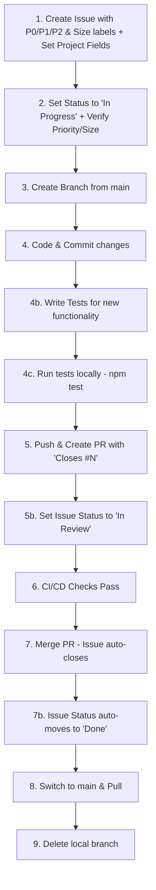

# MyRecipeApp

A React Native cooking recipe app with media support, export/import functionality, and comprehensive CI/CD pipeline.

## Features

- 📝 Create, edit, and delete recipes
- 📷 Add images from camera/gallery
- 🎥 Link TikTok/YouTube videos to recipes
- 🤖 **NEW:** AI-powered recipe extraction from text/transcripts
- 📤 Export recipes to JSON
- 📥 Import recipes from JSON
- 🔍 Browse and search recipes
- 💾 Local storage with AsyncStorage
- 🌐 Works on web and mobile (Android/iOS)

## Tech Stack

- **Framework:** React Native with Expo SDK 54
- **Storage:** AsyncStorage
- **Media:** expo-image-picker, expo-av
- **Testing:** Jest, React Native Testing Library
- **CI/CD:** GitHub Actions
- **Security:** npm audit, ESLint security plugin

## Getting Started

### Prerequisites

- Node.js 18+
- npm or yarn
- Expo Go app (for mobile testing)

### Installation

```bash
# Install dependencies
npm install

# Start development server
npm start

# Run on web
npm run web

# Run on Android (with device/emulator)
npm run android

# Run on iOS (macOS only)
npm run ios
```

### Configuration (Optional)

#### AI Recipe Extraction Setup

To enable automatic recipe extraction from video descriptions/transcripts using **GitHub Models (FREE)**:

1. **Get a GitHub Personal Access Token:**
   - Go to https://github.com/settings/tokens
   - Click "Generate new token (classic)"
   - Give it a name (e.g., "Cooking App")
   - Select scopes: `repo`, `read:packages`
   - Click "Generate token" and copy it

2. **Configure Environment:**
   ```bash
   # Copy the example file
   cp .env.example .env
   
   # Edit .env and add your GitHub token
   GITHUB_TOKEN=ghp_your_actual_token_here
   ```

3. **Restart the server:**
   ```bash
   npm start
   ```

   **Important:** If you change the `.env` file while the app is running, you need to clear the cache and restart:
   ```bash
   # Clean start (clears Metro bundler cache)
   npm run start:clean
   
   # Or for web only
   npm run web:clean
   ```
   
   Also clear your browser cache (Ctrl+Shift+R) or open in an incognito window when testing on web.

**Note:** GitHub Models provides **FREE** access to GPT-4o and other AI models for GitHub users. No credit card required! Without the token, you can still add recipes manually.

### Testing

```bash
# Run tests
npm test

# Run tests with coverage
npm run test:coverage

# Run tests in watch mode
npm run test:watch

# Security audit
npm run security

# Linting
npm run lint
```

## Project Workflow

### Complete Development Workflow Summary



**Priority Labels:**
- `P0` - Critical/Blocking (fix immediately)
- `P1` - High priority (next sprint)
- `P2` - Medium/Low (backlog)

**Size Labels:**
- `size: XS` - Less than 1 hour
- `size: S` - 1-4 hours
- `size: M` - 1-2 days
- `size: L` - 3-5 days
- `size: XL` - More than 1 week

### ⚠️ IMPORTANT: Never Work Directly on Main Branch

**ALWAYS create a feature branch before making any code changes.** Direct commits to `main` are not allowed.

**Exception:** Documentation-only changes (typos, formatting, minor clarifications) may be committed directly to main with a `docs:` prefix, but feature documentation should still go through PR process.

### Development Process

#### 1. Create Issue (REQUIRED BEFORE ANY CODE CHANGES)
**⚠️ Never start coding without creating an issue first!**

- **Title:** Clear, descriptive title
- **Body:** Detailed requirements and acceptance criteria
- **Labels:** 
  - **Type:** `enhancement`, `bug`, `security`, `documentation`, or `chore`
  - **Priority:** `P0` (critical/blocking), `P1` (high), or `P2` (medium/low)
  - **Size:** `size: XS` (<1h), `size: S` (1-4h), `size: M` (1-2 days), `size: L` (3-5 days), `size: XL` (>1 week)
- **Assign:** Assign to yourself or team member
- **Project Fields:** Set Priority and Size in the project (not just labels)
- **Status:** Issue will be in "Backlog" status initially

**Example:**
```bash
# Create issue with labels
gh issue create -t "Add ingredient quantity validation" \
  -b "Validate that quantities are positive numbers..." \
  -l "enhancement,P1,size: S"

# IMPORTANT: After creating the issue, set the Priority and Size fields in the GitHub Project
# Option 1: Via GitHub Web UI
# - Go to the project board
# - Find your issue
# - Set Priority field to P0, P1, or P2
# - Set Size field to XS, S, M, L, or XL

# Option 2: Via GitHub CLI (recommended for automation)
# Get the project item ID first, then set the fields using GraphQL mutations
# See the project documentation for field IDs and option IDs
```

#### 2. Update Issue Status and Project Fields
**Before creating your branch, update the issue:**

1. **Set Status to "In Progress":**
   - Go to the issue on GitHub or project board
   - Change status from "Backlog" to "In Progress"
   - This lets the team know you're actively working on it

2. **Verify Project Fields (if not set during creation):**
   - **Priority:** Should be set to P0, P1, or P2
   - **Size:** Should be set to XS, S, M, L, or XL
   - These appear in the right sidebar of the issue under the project section

#### 3. Create Branch (REQUIRED)
**Always branch from `main` before making any changes:**
```bash
git checkout main
git pull origin main
git checkout -b feature/issue-N-description
```

**Branch Naming Convention:**
- `feature/issue-N-description` - New features
- `bugfix/issue-N-description` - Bug fixes
- `hotfix/critical-issue-description` - Urgent production fixes
- `docs/issue-N-description` - Documentation updates
- `chore/issue-N-description` - Maintenance tasks

**Always include issue number in branch name!**

#### 4. Develop Locally
- Make **atomic commits** (one logical change per commit)
- Reference issue in commits: `"feat: add image picker (Issue #5)"`
- **Write tests for new functionality** (required for all features)
- Run tests locally before pushing: `npm test`
- Pre-commit hooks automatically run tests and security checks

**Testing Requirements:**
- All new features must include corresponding test cases
- Tests should cover core functionality, edge cases, and error handling
- Aim for meaningful test coverage (not just 100% for the sake of it)
- Tests must pass before creating PR

**Commit Message Convention:**
```bash
feat: add image picker to recipe form (Issue #5)
fix: export crashes on empty recipes (Issue #5)
security: update vulnerable dependencies (Issue #5)
docs: update README with media features (Issue #5)
refactor: simplify export logic (Issue #5)
test: add unit tests for export function (Issue #5)
chore: update dependencies (Issue #5)
```

#### 5. Create Pull Request
- **Title:** `"Add feature X (Closes #N)"` or `"Fix bug Y (Closes #N)"`
- **Body:** Include `"Closes #N"` or `"Fixes #N"` to auto-link and close issue
- **Description:** Summarize changes, testing status, and screenshots if applicable
- **Tests Required:** All PRs with new functionality must include tests
- **Manual Testing Guide:** For user-facing changes, include a step-by-step testing guide in the PR (see template below)
- **Wait:** CI/CD pipeline must pass before merging

**After creating the PR, update issue status:**
- Go to the issue on GitHub or project board
- Change status from "In Progress" to "In Review"
- This indicates the work is complete and awaiting code review/merge

**PR Template:**
```markdown
## Summary
Brief description of changes

## Changes
- ✅ Feature/fix 1
- ✅ Feature/fix 2

## Testing
- ✅ Tests written and pass locally (20/20 tests passing)
- ✅ Tested on web
- 🟡 Mobile testing pending

## 📋 Manual Testing Guide (Required for User-Facing Changes)

### Prerequisites
- List setup steps (npm install, environment config, etc.)

### Test 1: [Feature Name]
**Steps:**
1. Step-by-step instructions
2. What to click/tap
3. What data to enter

**Expected Results:**
- [ ] Expected behavior 1
- [ ] Expected behavior 2

### Test 2: [Another Feature/Edge Case]
**Steps:**
1. ...

**Expected Results:**
- [ ] ...

### Cross-Platform Verification
- [ ] Tested on Web
- [ ] Tested on Android
- [ ] Tested on iOS (if applicable)

## ✅ Testing Sign-off
- [ ] All manual tests passed
- [ ] User confirms feature works as expected

Closes #N
```

#### 6. Review
- **Self-review:** Check code quality and test coverage
- **CI/CD:** Verify all checks pass (quality, test, security, build)
- **Address feedback:** Make changes if needed

#### 7. Merge
- **Method:** Use "Squash and merge" (keeps main history clean)
- **Auto-close:** Issue automatically closes when PR is merged
- **Status Update:** Issue status automatically moves from "In Review" to "Done"
- **Branch:** Automatically deleted after merge

#### 8. Post-Merge Cleanup
**After PR is merged, clean up your local environment:**
```bash
# Switch back to main
git checkout main

# Pull the latest changes (includes your merged PR)
git pull origin main

# Delete your local feature branch
git branch -d feature/issue-N-description

# Verify issue is closed and status shows "Done" on GitHub
```

#### 9. If More Work Needed

**Option A: Small fix related to same issue**
```bash
# Create NEW issue for the fix (e.g., Issue #6)
gh issue create -t "Fix edge case in feature X" -l "bug,P1,size: XS"

# Update status to "In Progress"
# Create branch
git checkout main
git pull origin main
git checkout -b bugfix/issue-6-edge-case-fix

# Make fix and create PR referencing new issue
# PR title: "Fix edge case (Closes #6)"
```

**Option B: New feature or unrelated change**
- Create **new issue** with appropriate labels
- Update status to "In Progress"
- Follow workflow from step 3

**❌ Never:** Reopen or reuse merged PRs/branches

### Hotfix Workflow (Urgent Issues)

For critical bugs in production:

```bash
# 1. Create hotfix branch from main
git checkout main
git pull origin main
git checkout -b hotfix/critical-bug-description

# 2. Fix the issue quickly
# Make minimal changes

# 3. Create PR with [HOTFIX] prefix
# Title: "[HOTFIX] Fix critical security issue"

# 4. Fast-track review and merge
# 5. Deploy immediately
```

### Merge Strategy

**Squash and Merge (Recommended)**
- ✅ Clean main branch history (one commit per feature)
- ✅ Easy to revert entire features
- ✅ Simplified git log
- One squashed commit per PR on main

### Branch Protection Rules

Main branch is protected with:
- ✅ Require pull request before merging
- ✅ Require status checks to pass (quality, test, security, build)
- ✅ Require branches to be up to date before merging
- ❌ Force pushes disabled
- ✅ Automatic branch deletion after merge

## CI/CD Pipeline

The project uses GitHub Actions for automated testing and validation:

### Jobs

1. **Quality** - Code quality and linting checks
2. **Test** - Unit and integration tests with coverage
3. **Security** - npm audit and vulnerability scanning
4. **Build** - Build validation and configuration checks

### Pre-commit Hooks

Local hooks run before each commit:
- Jest tests
- npm security audit
- Prevents commits with failing tests or vulnerabilities

## Project Structure

```
MyRecipeApp/
├── App.js              # Main application file
├── assets/             # Images, fonts, etc.
├── components/         # Reusable components (legacy)
├── contexts/           # React contexts (legacy)
├── screens/            # Screen components (legacy)
├── coverage/           # Test coverage reports
├── jest.setup.js       # Jest configuration
├── package.json        # Dependencies and scripts
└── app.json           # Expo configuration
```

## Testing Documentation

### Automated Tests

The AI recipe extraction feature has been thoroughly tested:

- **[TESTING_SUMMARY.md](TESTING_SUMMARY.md)** - Quick overview and results
- **[TEST_RESULTS_REPORT.md](TEST_RESULTS_REPORT.md)** - Comprehensive test report
- **[TESTING_GUIDE.md](TESTING_GUIDE.md)** - Manual testing procedures

### Test Scripts

```bash
# Run single transcript test
node test-extraction-api.js

# Run all 6 transcript tests
node test-all-transcripts.js
```

### Test Data

- **test-transcripts.js** - Raw transcript data (6 diverse recipes)
- **TEST_TRANSCRIPTS_COPY.md** - Easy copy-paste format for manual testing

### Test Results Summary

✅ **100% Success Rate** (6/6 tests)  
⭐ **93% Quality Score** (6.5/7 average)  
⏱️ **2.7s Avg Response Time**  
💰 **$0.00 Cost** (FREE GitHub Models API)

## Contributing

1. **ALWAYS create a branch** before making changes (never work on main)
2. Follow the project workflow above
3. Ensure all tests pass
4. Update documentation as needed
5. Add tests for new features
6. Follow commit message conventions

## License

0BSD

## Support

For issues and questions, please create a GitHub issue using the appropriate template.
