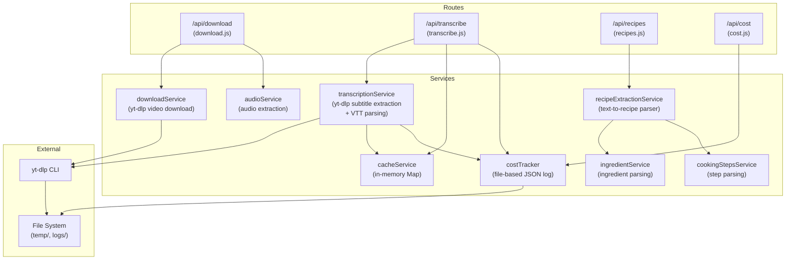
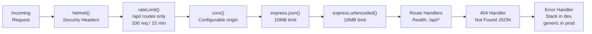
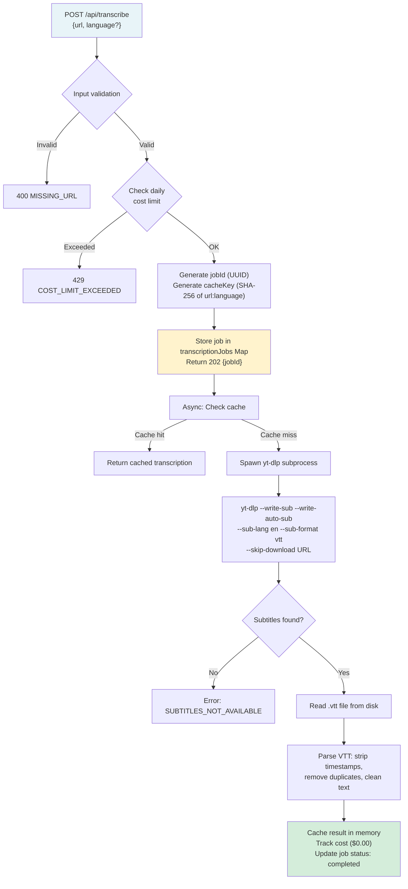

# Backend Architecture

This document describes the internal architecture of the MyRecipeApp backend -- a Node.js + Express API server that handles video subtitle extraction and recipe parsing.

## Component Diagram



## Middleware Stack

Requests pass through middleware in this exact order, as defined in `server.js`:



### Middleware Details

| Middleware | Configuration | Purpose |
|-----------|--------------|---------|
| **helmet** | Default settings | Sets security headers (X-Content-Type-Options, X-Frame-Options, CSP, etc.) |
| **rateLimit** | 100 requests per 15-minute window, applied to `/api/` prefix only | Prevents API abuse. Configurable via `RATE_LIMIT_WINDOW_MS` and `RATE_LIMIT_MAX` env vars. |
| **cors** | Origin from `config.corsOrigin` (defaults to `http://localhost:8081`) | Cross-origin request handling. Production deployments must explicitly configure allowed origins. |
| **express.json** | 10MB body limit | Parses JSON request bodies. |
| **express.urlencoded** | 10MB limit, extended mode | Parses URL-encoded form data. |

### Health and Version Endpoints

These are defined directly in `server.js`. `/health` is outside the `/api/` prefix and is not rate-limited, while `/api/version` is subject to the API rate limiter:

- `GET /health` -- returns status, timestamp, environment, and uptime (not rate-limited)
- `GET /api/version` -- returns version `1.0.0`, API `v1`, and supported features (rate-limited)

## API Data Flow: Video URL to Structured Recipe

This is the primary backend use case -- extracting a recipe from a video URL in two phases.

### Phase 1: Subtitle Extraction (POST /api/transcribe)



### Phase 2: Recipe Extraction (POST /api/recipes)

```mermaid
flowchart TD
    A["POST /api/recipes\n{transcribedText, options?}"] --> B{Input validation}
    B -->|Invalid| B1["400 MISSING_TEXT"]
    B -->|Valid| C{Queue capacity\ncheck (max 1000)}
    C -->|Full| C1["503 QUEUE_FULL"]
    C -->|OK| D["Generate jobId (UUID)\nCreate job with steps:\n1. Queued\n2. Text Parsing\n3. Ingredient Extraction\n4. Step Extraction"]
    D --> E["Store in recipeJobs Map\nReturn 202 {jobId}"]
    E --> F["Async: recipeExtractionService.extractRecipe()"]
    F --> G["ingredientService.parseIngredients()\nPattern matching for quantities,\nunits, ingredient names"]
    G --> H["cookingStepsService.parseSteps()\nSequential instruction extraction\nwith timing detection"]
    H --> I["Assemble structured recipe:\ntitle, ingredients[], instructions[],\nmetadata, confidence scores"]
    I --> J["Update job: status=completed\nStore result in Map"]

    style A fill:#e8f4f8
    style E fill:#fff3cd
    style J fill:#d4edda
```

### Job Polling

Both phases use the same async job pattern. The frontend polls for status:

- `GET /api/transcribe/:jobId` -- returns job status, progress percentage, step details, and result when complete
- `GET /api/recipes/:jobId` -- returns job status, progress, steps, and structured recipe when complete

Job statuses: `queued` -> `processing` -> `completed` | `failed`

## Route and Endpoint Reference

### /api/download (download.js)

| Method | Path | Description |
|--------|------|-------------|
| POST | `/api/download` | Start video download + audio extraction. Returns jobId. |
| GET | `/api/download/:id` | Poll download/extraction status. |

### /api/transcribe (transcribe.js)

| Method | Path | Description |
|--------|------|-------------|
| POST | `/api/transcribe` | Start subtitle extraction from video URL. Accepts `{url, language?, audioMinutes?}`. Returns jobId. |
| GET | `/api/transcribe/:id` | Poll transcription status and retrieve result. |

### /api/recipes (recipes.js)

| Method | Path | Description |
|--------|------|-------------|
| POST | `/api/recipes` | Start recipe extraction from transcribed text. Accepts `{transcribedText, options?}`. Returns jobId. |
| GET | `/api/recipes/:id` | Poll recipe extraction status and retrieve structured recipe. |
| PUT | `/api/recipes/:id` | Update a completed recipe result. |
| DELETE | `/api/recipes/:id` | Cancel or remove a recipe extraction job. |

### /api/cost (cost.js)

| Method | Path | Description |
|--------|------|-------------|
| GET | `/api/cost/summary` | Daily, monthly, and total cost statistics. |
| GET | `/api/cost/daily` | Today's cost log entries. Accepts `?limit=N` (default 100, max 1000). |
| GET | `/api/cost/alerts` | Cost limit alerts and warnings. |

## Key Design Decisions

### Async Job Pattern with In-Memory Maps

All long-running operations (download, transcription, recipe extraction) use the same pattern:
1. Client sends POST request with input data
2. Server creates a job with a UUID, stores it in an in-memory `Map`, and returns 202 with the jobId
3. Server processes the job asynchronously
4. Client polls GET `/:jobId` for status updates

Trade-offs:
- Simple to implement, no database dependency
- Jobs are lost on server restart (logged warning at startup)
- Queue size is capped at 1000 jobs per route to prevent unbounded memory growth
- Hourly cleanup removes jobs older than 24 hours

### File-Based Cost Tracking

The `costTracker` service appends cost entries to `logs/cost-tracking.json`. This provides:
- Transparent API usage monitoring
- Daily and monthly aggregation
- Configurable alert thresholds (`COST_ALERT_THRESHOLD`, `COST_DAILY_LIMIT` env vars)

Currently all operations cost $0.00 since subtitle extraction via yt-dlp is free. The tracking infrastructure exists for when paid AI API calls are introduced.

### VTT Subtitle Parsing

Instead of using a paid transcription API, the backend:
1. Spawns yt-dlp as a child process with `--write-sub --write-auto-sub --skip-download`
2. Downloads the VTT (WebVTT) subtitle file from the video platform
3. Parses the VTT format: strips timestamp lines, removes duplicate text segments, cleans formatting
4. Returns clean text for recipe extraction

This approach is free, fast, and works for any video with subtitles or auto-generated captions.

### Transcription Caching

The `cacheService` uses an in-memory `Map` keyed by SHA-256 hash of `url:language`. Configuration:
- TTL: 30 days
- Max entries: 10,000
- Eviction: oldest entries removed when capacity is exceeded

Cache is lost on server restart. For production, the code notes that Redis should be used for distributed caching.

### Recipe Extraction (Text Parsing)

The `recipeExtractionService` uses pattern matching (not AI) to extract structured data:
- `ingredientService` -- parses quantity, unit, and ingredient name using regex patterns
- `cookingStepsService` -- extracts sequential cooking instructions with timing detection
- Confidence scores indicate extraction quality
- Options: `strictMode` rejects low-confidence results, `minConfidence` sets the threshold
