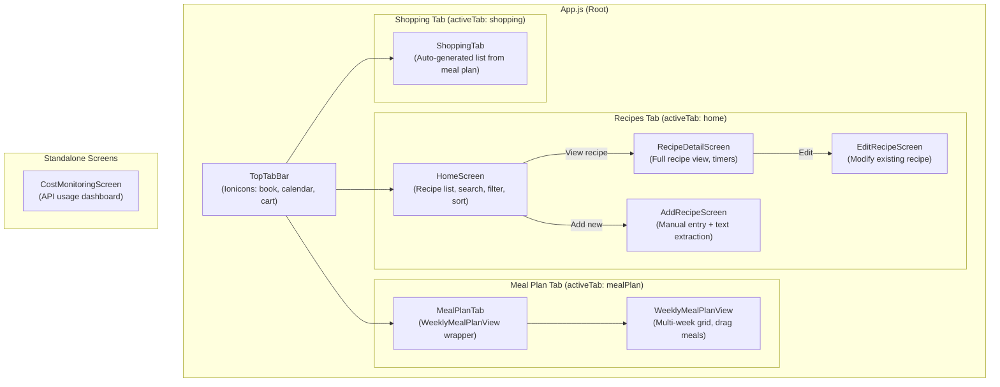
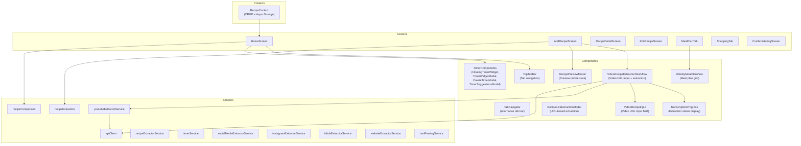

# Frontend Architecture

This document describes the internal architecture of the MyRecipeApp frontend -- a React Native + Expo application that runs on Android (primary), Web (supported), and iOS (planned).

## Screen Hierarchy

The app uses a custom tab-based navigation system implemented with TopTabBar (icon-based top tabs) and screen-level state management in App.js.

### Navigation Model

The app uses a hybrid navigation approach:

- **TopTabBar** -- a custom component (not React Navigation tabs) that switches between three main sections using `activeTab` state in App.js. Tabs are: Recipes (`home`), Meal Plan (`mealPlan`), Shopping (`shopping`).
- **Screen switching** -- within the Recipes tab, a `screen` state variable controls which screen is displayed (`home`, `add`, `detail`, `edit`). This is a simple state-based router, not a stack navigator.
- **React Navigation** -- `NavigationContainer` wraps the app for compatibility with navigation-dependent libraries, but primary routing is state-driven.

## Component Structure

## Service Layer

The services directory contains business logic separated from UI components. Each service handles a specific domain.

### Core Services

| Service | File | Responsibility |
|---------|------|---------------|
| **apiClient** | `apiClient.js` | Centralized Axios HTTP client for all backend calls. Configures base URL, 60s timeout, 3 retry attempts with 1s delay, request/response logging. Endpoint mapping for all API routes. |
| **recipeExtraction** | `recipeExtraction.js` | Client-side text-to-recipe parsing. Extracts structured recipe data from pasted text using pattern matching. Also infers recipe category from content. |
| **timerService** | `timerService.js` | Cooking timer management: create, start, pause, resume, delete timers. Handles timer state persistence to AsyncStorage and vibration alerts on completion. |
| **recipeComparison** | `recipeComparison.js` | Duplicate detection. Compares new recipes against existing collection to warn before saving duplicates. |
| **textParsingService** | `textParsingService.js` | General text parsing utilities used by extraction services. |

### Platform-Specific Extractor Services

These services handle recipe extraction from different video/content platforms:

| Service | File | Responsibility |
|---------|------|---------------|
| **youtubeExtractorService** | `youtubeExtractorService.js` | Fetches YouTube transcripts via backend API (POST /api/download, POST /api/transcribe). Includes client-side caching with 1-hour TTL in AsyncStorage. |
| **instagramExtractorService** | `instagramExtractorService.js` | Instagram video/reel recipe extraction. |
| **tiktokExtractorService** | `tiktokExtractorService.js` | TikTok video recipe extraction. |
| **websiteExtractorService** | `websiteExtractorService.js` | Generic website recipe scraping. |
| **socialMediaExtractorService** | `socialMediaExtractorService.js` | Shared utilities for social media platform extractors. |
| **recipeExtractorService** | `recipeExtractorService.js` | Orchestrates extraction across platforms -- determines platform from URL and delegates to the appropriate extractor. |

## State Management

The app uses a combination of React state and context for data management.

```mermaid
graph TB
    subgraph App.js State
        RS["recipes: Recipe[]"]
        SS["screen: string"]
        SR["selectedRecipe: Recipe"]
        TM["timers: Timer[]"]
        SL["shoppingList: ShoppingItem[]"]
        FI["filters: {prepTimeMax, cookTimeMax, category}"]
        SB["sortBy: string"]
        SQ["searchQuery: string"]
        MP["mealPlanRefresh: number"]
        EX["extractionHistory: string[]"]
    end

    subgraph RecipeContext
        CR["recipes: Recipe[]"]
        ADD["addRecipe()"]
        UPD["updateRecipe()"]
        DEL["deleteRecipe()"]
    end

    subgraph AsyncStorage
        ASR["'recipes' -> JSON"]
        ASMP["'@myrecipeapp/meal_plan' -> JSON"]
        ASSL["'shoppingList' -> JSON"]
        AST["'cookingTimers' -> JSON"]
        ASEH["'extractionHistory' -> JSON"]
        ASEF["'extractionFeedback' -> JSON"]
    end

    RS -->|"Load on mount"| ASR
    RS -->|"Save on change"| ASR
    CR -->|"Persist via saveRecipes()"| ASR
    TM -->|"Persist"| AST
    SL -->|"Persist"| ASSL
    EX -->|"Persist"| ASEH
```

### State Architecture Notes

- **App.js is the primary state owner.** Most application state lives in `useState` hooks within the `AppContent` component in App.js. This is a pragmatic choice for the current app size.
- **RecipeContext** provides an alternative recipe management interface with `useRecipes()` hook. It wraps AsyncStorage with add/update/delete operations and data normalization (ensuring all fields are strings).
- **No Redux or external state library.** State flows via props from App.js to child screens and components.
- **AsyncStorage is the persistence layer.** All user data is stored on-device as JSON strings. There is no user account system or cloud sync.

## Platform Support

| Platform | Status | Notes |
|----------|--------|-------|
| **Android** | Primary | Production target. EAS Build configured. Tested on physical devices and emulators. |
| **Web** | Supported | Runs via `expo start --web`. Requires `EXPO_PUBLIC_` prefix for environment variables. Some native modules are mocked for web compatibility. |
| **iOS** | Planned | Expo supports iOS builds, but iOS has not been tested or submitted to App Store. |

### Platform-Specific Considerations

- **TopTabBar** uses `@expo/vector-icons` (Ionicons) which works across all platforms
- **AsyncStorage** works on all platforms (uses localStorage on web)
- **Vibration API** for timer alerts is mobile-only; web falls back gracefully
- **ImagePicker and FileSystem** from Expo have platform-specific behavior
- **Safe area handling** uses Platform.OS checks for iOS bottom padding

## Key Patterns

### Video Recipe Extraction Workflow

The `VideoRecipeExtractionWorkflow` component orchestrates the multi-step extraction process:

1. User enters a video URL
2. Component determines the platform (YouTube, Instagram, TikTok, website)
3. Delegates to the appropriate extractor service
4. Extractor calls the backend API (transcribe -> recipe extract)
5. Displays progress via `TranscriptionProgress`
6. Shows result in `RecipePreviewModal`
7. User confirms to save recipe to local storage

### Duplicate Detection

Before saving any recipe (manual or extracted), the app:
1. Calls `checkForDuplicate()` from `recipeComparison.js`
2. Compares title similarity against existing recipes
3. Shows `DuplicateModal` if a match is found
4. User can choose to save anyway or cancel

### Timer System

The timer system is fully client-side:
- `timerService.js` manages timer lifecycle (create, start, pause, resume, delete)
- `FloatingTimerWidget` shows active timers as an overlay on all screens
- `TimerSuggestionsModal` parses recipe instructions for time references and suggests timers
- Timers persist to AsyncStorage and survive app restarts
- Vibration alerts on mobile when timers complete
