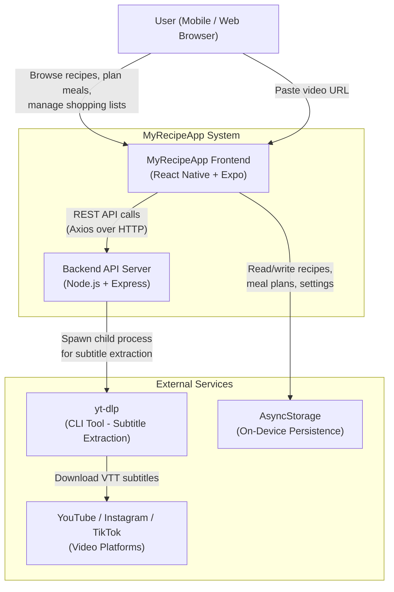
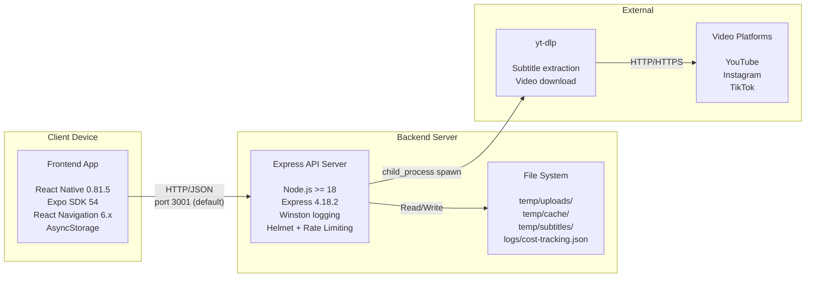
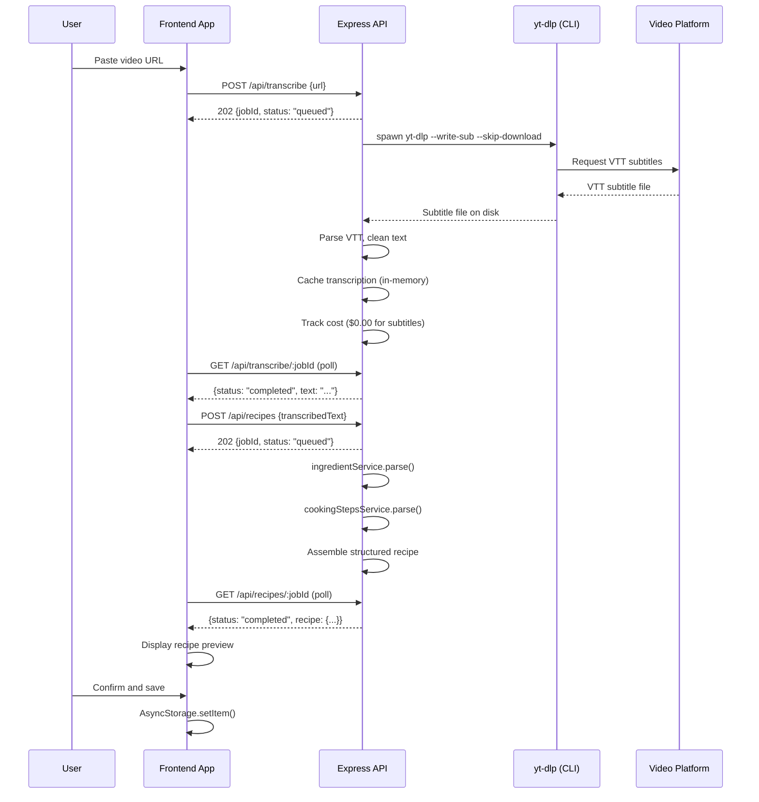

# Architecture Overview

This document provides a high-level view of the MyRecipeApp system architecture, covering system context, container structure, component responsibilities, and data flow.

## System Context Diagram

This diagram shows how MyRecipeApp fits into the broader ecosystem of users and external services.

## Container Diagram

This diagram breaks the system into its deployable containers and shows the technology choices and communication patterns.

## Component Responsibilities

### Frontend (MyRecipeApp/)

| Component | Responsibility |
|-----------|---------------|
| **App.js** | Main entry point. Manages top-level state (recipes, timers, meal plans, shopping lists), screen routing via custom tab navigation, and data persistence with AsyncStorage. |
| **Screens (8)** | UI for each app section: HomeScreen, AddRecipeScreen, EditRecipeScreen, RecipeDetailScreen, RecipesTab, MealPlanTab, ShoppingTab, CostMonitoringScreen. |
| **Components (10+)** | Reusable UI: TopTabBar (icon-based tab navigation), TabNavigator, WeeklyMealPlanView, VideoRecipeExtractionWorkflow, TimerComponents (floating widget, modals), TranscriptionProgress. |
| **Services (11)** | Business logic layer: apiClient (centralized HTTP with retry), youtubeExtractorService, recipeExtraction (text parsing), timerService, platform-specific extractors (Instagram, TikTok, website). |
| **Contexts** | RecipeContext provides shared recipe state (CRUD operations) with AsyncStorage persistence. |

### Backend (backend/)

| Component | Responsibility |
|-----------|---------------|
| **server.js** | Express app setup: middleware stack (helmet, rate limiter, CORS, JSON parser), route mounting, 404/error handlers, graceful shutdown. |
| **Routes (4)** | HTTP request handling: download (video download), transcribe (subtitle extraction), recipes (recipe extraction from text), cost (usage monitoring). |
| **Services (8)** | Core logic: downloadService (yt-dlp video download), transcriptionService (yt-dlp subtitle extraction + VTT parsing), recipeExtractionService (text-to-structured-recipe), ingredientService, cookingStepsService, audioService, cacheService (in-memory Map), costTracker (file-based JSON log). |
| **Config** | env.js (environment variable loading), logger.js (Winston structured logging), deploymentUtils.js. |

## Data Flow Overview

### Recipe Extraction (Primary Use Case)

The main use case is extracting a structured recipe from a cooking video URL. The flow spans both frontend and backend:

### Local Operations (No Backend)

Many features operate entirely on-device without backend calls:

- **Recipe CRUD** -- recipes are stored in AsyncStorage and managed through RecipeContext
- **Meal Planning** -- weekly meal plan assignments stored in AsyncStorage
- **Shopping Lists** -- auto-generated from meal plan ingredients, stored locally
- **Cooking Timers** -- managed by timerService with local state and vibration alerts
- **Search and Filter** -- client-side filtering of the local recipe collection
- **Import/Export** -- JSON-based recipe sharing via file system

### Data Persistence

All user data is persisted on-device using AsyncStorage with these keys:

| Key | Data |
|-----|------|
| `recipes` | Array of recipe objects |
| `@myrecipeapp/meal_plan` | Weekly meal plan assignments (also written to `mealPlan` for backward compat) |
| `shoppingList` | Current shopping list items |
| `cookingTimers` | Active timer state |
| `extractionHistory` | Last 10 extraction URLs |
| `extractionFeedback` | User feedback on extractions |

The backend maintains no persistent user data. It uses:
- **In-memory Maps** for job queues (download, transcribe, recipe extraction) -- lost on restart
- **In-memory Map** for transcription cache -- lost on restart
- **File-based JSON log** for cost tracking (`logs/cost-tracking.json`)
